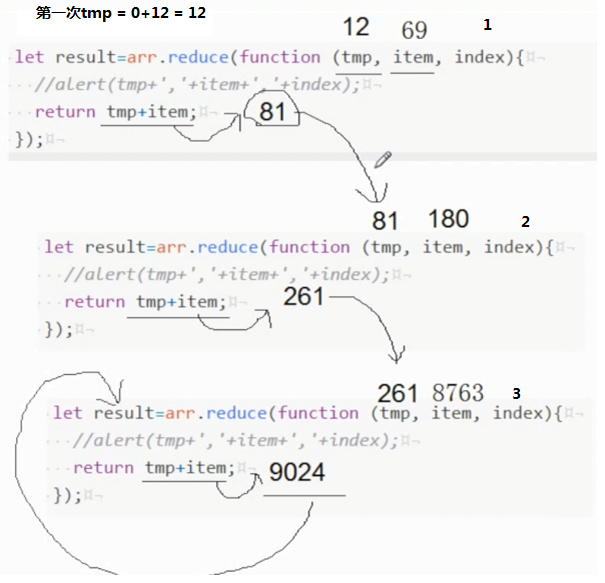
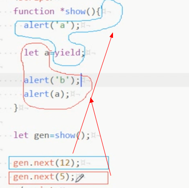
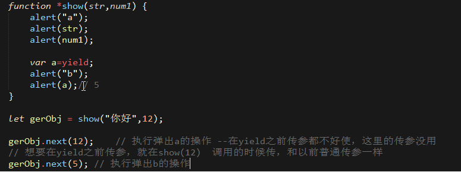

#ES6

[TOC]
#### 变量
**var**

1. 可以重复声明
2. 无法限制修改
3. 没有块级作用域
 
**let**     不能重复声明-->变量，可以修改,块级作用域
<a id="step1"></a>

**const**   不能重复声明-->常量，不能修改，块级作用域,一旦定义，必须立即赋值，不能等到后面再去赋值

```javascript
{
    let a = 12;
    alert(a);
}
alert(a); // a没有定义
```

4. var声明存在变量提升，let则不存在

>   这里的b是通过var进行声明的，在执行脚本的时候，已经将b这个变量提升到语句的最开始，只是，赋值在后面，所以，一开始访问，b是没有赋值的，所以，默认是undefined；而a通过let声明的，是不存在变量提升的，在访问时（console.log()），浏览器环境根本找不到a，所以，直接抛出异常

```js
    console.log(a); // ReferrenceError
    console.log(b); // undefined

    let a = 5;
    var b = 3;
```

5. let和const的暂时性死区（temporal dead zone）TDZ，如果是在{}中定义，是形成了块级作用域的


>   <font color="#E67E22">ES6规定暂时性死区和let、 const语句不出现变量提升， 主要是为了减少运行时错误， 防止在变量声明前就使用这个变量， 从而导致意料之外的行
为。 这样的错误在ES5是很常见的， 现在有了这种规定， 避免此类错误就很容易了。</font>


```js
    var a=5;
    {// 暂时性死区开始
         console.log(a);// ReferenceError: a is not defined
         // 暂时性死区结束
         let a=10;
         console.log(a);

         console.log(b);// ReferenceError: b is not defined
         const b = 1;
         console.log(b);
    }
```

>   所以，typeof去判断某一个对象的类型，就显得不那么靠谱了，如果是var声明的，以前怎么用，还怎么用；如果是let声明的，那么就得谨慎了

```js
    typeof x;// 报错，x是未定义 这和上面的
    let x;

    // 情况二：用var声明
    typeof a;   // undefined  至少还是以一种js的类型
    var a;

    typeof c; // undefined 这里的 c并没有声明。浏览器会默认给它声明的，额，最好不要这么干
```

- 聊一聊块级作用域

>   ES5只有全局作用域和函数级作用域，没有块级作用域，相信这是很多js类书籍都会提及的，而类比的语言，大都是java，c#等，这些语言是有块级作用域的

>   块级作用域不合理的应用场景
>   
>   - <font color="#912CEE">变量覆盖</font>，冷不丁的造成一些不必要的麻烦

```js
    var a = 5;
    var b = 7;

    if(true) {
        var a = "ss";   // 直接干掉了外层的a，重生声明了一遍，不合理
    }

    function f() {
        console.log(b);
        if(true) {
            var b = 15; // 由于存在变量提升，所以，这里的b会覆盖外层的b
        }
    }
    f();// undefined
```

>   - <font color="#912CEE">内存泄漏</font>

```js
    for(var i=0;i<5;i++) {
        console.log(i);
    }
    // 这里的i在作用上，只是作为一个循环变量，出了这个循环，我们是不希望在其他地方还能访问，
    //所以，这就造成内存泄漏，成为全局变量，形成了污染
    console.log(i); // 5 
```

**const**

>   常量，上面有讲它几乎所有的特性 <a href="#step1">上去</a>

>   对于复合类型的变量，变量名指向数据，而是指向数据所在的地址。const只保证变量名的地址不变，不保证这个地址的数据不变

```js
    const o = {};
    o.a = 55;
    o.say = function () {
        console.log("第一次");
    }

    o.a = 77;
    console.log(o.a);// 77
    o.say = function() {
        console.log("第二次");
    }
    o.say();// 第二次

    // 但是下面的操作，一定报错
    o = {};  // error o早已经定义，这里重新赋值一个{} ，是改变了o指向对象的地址了
```

-----------------

**函数，箭头函数**
```js
    function 名字() {

    }
    // 改写
    ()=>{

    }

    // 对比
    window.onload = function() {
        alert("abc");
    }

    window.onload = ()=>{
        alert("abc");
    }

    let show = function() {
        alert("1");
    }

    let show = () {
        alert("2");
    }
    // 2种写法一样
    show();

    // 看下面的例子改写

    var arr = [12,5,7,8];
    arr.sort(function(n1,n2) {
        return n1-n2;
    });
    alert(arr); // 5,7,8,12

    arr.sort((n1,n2)=>{
        return n1-n2;
    });//一样的效果
```
1. 如果函数只有一个参数，()可以省略
```js
    let show = function(a) {
        alert(a*2);
    }
    show(12);// 24

    // 改写
    let show = (a) => {
        alert(a*2);
    }
    show(12);//24

    // 一个参数，进一步改写，只有一个参数--省略（），只有参数为一个，才能用
    let show = a=>{
        alert(a*2);
    }
    show(12);//24
```
2. 如果函数只有一个return，｛｝可以省略
```js
    let ignore = a=>a+2; // 模仿lambda表达式
    ignore(1);

    // 数组排序的改法
    let arr2 = [11,1,5,2];
    arr2.sort((n1,n2)=>n1-n2;
    alert(arr2); //1,2,5,11
```

箭头函数就是简写，感觉也没啥特别的

### 函数的参数
1、参数的扩展/展开 (Rest Paramters--剩余参数)
```js
    // 常规的--你是知道要传几个参数进来
    function show(a,b) {
        alert(a);
        alert(b);
        alert(arguments.length); // 4个
    }
    // 如果你按照下面的传参--弹完12，5就不会再有效果了
    show(12,5,7,8);

    // es6里面的扩展是 剩余参数--args叫什么名字无所谓
    function show(a,b,...args) {
        alert(a);
        alert(b);
        alert(args); // 弹3，4 一起出来的
        console.log(typeof args); // object
        console.log(args instanceof Array);// true  所以它是一个数组集合的形式存在的
        // 那么，数组有的属性和方法，args也会拥有
        // 访问
        console.log(args[0]);// 3
    }
    show(1,2,3,4);

    // 下面是错误的写法
    function errorsExample(a,b,...args,c) { // 报错，args只能是最后一个，后面不能再接参数
        //Rest parameter must be last formal parameter
        alert(a);
        alert(b);
        alert(args);
        alert(c);
    }
```

**参数扩展**

1. ...args是用来收集剩余参数
    function show(a,b,...args) {}
    ...args--Rest parameter 必须是最后一个参数

```js
    var arr =[1,2,3];  // 等价于
    ...arr// 返回给你的就是1，2，3

    // 示例
    var arr= [1,2,3];

    function open(a,b,c) {
        alert(a);
        alert(b);
        alert(c);
    }
    open(...arr);
```

2. ...args还可以用来展开数组

```javascript
    var arr1 = [1,2,3];
    var arr2 = [4,5,6];

    var arr = [...arr1,arr2]; // 等价与 arr=[1,2,3,4,5,6]
    alert(arr);// 1,2,3,4,5,6
```

**展开后的效果，跟直接把数组的内容写到里面一样**

```js
    function f1(...args) { // 这里将参数收集
        f2(...args);    // 这里又将参数展开 == f2(12,5);
    }
    function f2(a,b) {
        alert(a+b);
    }

    f1(12,5);
```
**默认参数**

```js
    function f1(a,b=5,c=12) {
        console.log(a,b,c);
    }
    f1(88);// 88,5,12 

    f1(88,0,5);// 88,0,5  你传了，就用你传的值，没传，就用默认值
```

### 解构赋值

1. 左右两边结构必须一样

```js
    //1 左边是什么，右边也是什么；左边是数组，右边就用数组
    let [m,n,h] = [4,5,6];
    console.log(m,n,h); //4 5 6

    // 左边用Json,右边也用json
    let {q,w,e} = {q:1,w:2,e:3};
    console.log(q,w,e);//1 2 3

    // 复杂点
    let [{a1,b1,c1},[ee,g],num,str]=[{a1:1,b1:2,c1:3},[12,5],4,"sss"];
    console.log(a1,b1,c1,ee,g,num,str);//1 2 3 12 5 4 "sss"

    //可以根据自己想要的 粒度 去拆分

    let [json,arr2,nn,ss] =[{m2:"1",n2:"2",k:"3"},[112,"fa"],44,"gggg"];
    console.log(json,arr2,nn,ss); // Object,Array,44,"gggg"
```

2. 右边必须是个东西

```js
// 错误的示例
let [a,b] = {5,4};   //这就不行，右边什么都不是，不是对象的结构，"键值对"
```

3. 声明和赋值不能分开（必须在一句话里面完成）

```js
    // 错误的示例
    let [a];
    [a] = [1];
    // 这种声明赋值不行
    let [a] = [1];// 结构赋值，必须声明和赋值一块办了，不能分开
```
- 不完全解构

>   等号左边的只匹配等号右边的一部分，这是可以的，这就是不完全解构

```js
    let [a,b] = [1,2,3];

    a;  //1
    b;  //2
```

- 默认值

>   ES6内部使用严格相等运算符（===） ， 判断（等号右边）一个位置是否有值。 所以， 如果（等号右边）一个数组成员不严格等于undefined， 默认值是不会生效的
>   
>   上面的话有点拗口，只要等号右边的数组，不是undefined，就采用右边的值，默认值作废；只要右边的值是undefined，那么，就采用左边的默认值

```js
    let [a="1",b] = [4,7];

    a //4
    b //7

    // 只要不是给赋值undefined，如果右边没有赋值的话，就会采用默认值
    
    let [a="1",b] = [7];
    
    a // 7
    b // undefined

    // 情况三:null 不严格等于undefined,所以，所以，默认值依旧是null
    let [a="1",b=null] = [7,undefined];
    
    a // 7
    b // null

    // 情况四： 右边undfined严格等于undefined,所以，默认值生效
    let [a=1] = [undefined];
    a //1

    // 情况五 : 右边null 不严格等于undefined，默认值不会生效
    let [a=1] = [null];
    a // null

```

>  <font color="#912CEE">如果将一个已经定义的变量，使用解构赋值，会报错 </font> 

```js
    var a;

    {a} = {a:1};  // 报错 -- 因为JavaScript引擎会将{x}理解成一个代码块， 从而发生语法错误
    
    // 解决办法--有不将大括号写在行首， 避免JavaScript将其解释为代码块， 才能解决这个问题
    ({a} = {a:1});

```

>   <font color="#912CEE">属性名表达式</font>
>  
>      
[arr.length-1] 是2，2在这里只是一个模式，不是变量，arr[2]对应的值是3，所以，last是3  方括号这种写法属于 属性表达式
```js
    var arr = [1,2,3];
    var {0:first,[arr.length-1]:last} = arr;

    first //1
    last  //3
```

>   <font color="#912CEE">字符串的解构赋值</font>
>   
>   字符串被转化成一个类似于数组的对象

```js
    let [a,b,c] = "你好啊";
    a // 你
    b // 好
    c // 啊

    let [m,n] = "hi";
    m // h
    n // i

    // 类数组，都有length属性 （length是模版，len才是变量）
    let {length: len} = "hello";
    len //5

``` 

<font color="#912CEE">Tips:</font> 解构赋值的规则是， 只要等号右边的值不是对象， 就先将其转为对象。 由于undefined和null无法转为对象， 所以对它们进行解构赋值， 都会报错。

```js
    let {prop:x} = undefined; // TypeError
    let {prop:y} = null; //TypeError
```

### 数组
1. **map    --映射** *一个对一个*
> 比如成绩表：[45,60,88] -- 可以映射成 [不及格，及格，及格]  <br/>
> 比如用户表： [1,2,3] -- >用户ID映射成对应的用户数据 <br/>
> [{name:"张三",levale:0,age:22},
> {name:"李四",levale:2,age:22},
> {name:"王武",levale:3,age:32}]
```js
let arr = [12,5,6];

// 用map将数组中的所有数据变成2倍，然后返回出来
let result = arr.map(function(item) {
    return item*2;
});
alert(result);// 24,10,12
console.log(arr);//12,5,6 --并不会去改变你的原始值

// 上面的，配合箭头函数
let result2 = arr.map(item => item*2);
alert(result2);


// 分数--应用成一个等级
let scope = [65,22,95];
let result3 = scope.map(item=>item>60?"及格":"不及格");
alert(result3);// 及格。不及格，及格 -- 说明一点，map不会去改变你的原始值，scope还是数值类型的数组
```
2. **reduce --汇总**  *一堆东西，最后出来一个结果*



*示例：算一个总和*
```js
let arr = [12,69,180,8763];
// tmp是一个临时存储的变量
// item 当前要加的那个值
// index是执行的次数吧
let result = arr.reduce(function(tmp,item,index) {
    return tmp+item;
});
alert(result);//9024

// 求平均数--这里要注意，不要用this,会出毛病
let result2 = arr.reduce(function(tmp,item,index) {
    if(index != arr.length-1) { // 说明不是最后一次
        return tmp+ item;
    } else {                // 最后一次，然后做一个除法
        return (tmp+item)/arr.length;   // 2256
    }
});
```
3. **filter --过滤**
```js
var arr = [12,11,10,6,"ss"];
// 情景： 能被3取模的留下，不能的，给过滤掉
let result = arr.filter(item=>{
    if(item%3==0) {
        return true;// 返回true 就留下
    } else {
        return false;
    }
});
console.log(result);    //12,6 --返回的是一个数组的形式

// 上面形式的简写形式
let result2 = arr.filter(item=>{
    // item%3 ==0 本身返回的就是Bool值
    return item %3 == 0;
})
console.log(result2);   // 12,6

// 再简写
let result3 = arr.filter(item=>item%3==0);  //12,6

// 示例3
let shop = [
    {"name":"包包","price":10000,"product":"Made In China"},
    {"name":"鞋子","price":5000,"product":"Made In Japanese"},
    {"name":"包包","price":200,"product":"Made In American"}
];
let h = shop.filter(item=>item.price>500);// 返回来2个，最外层是数组类型，里面装着2个json
console.log(h);

```

4. **forEach --循环（迭代）**
```js
var arr = [12,9,10];
// index是当前循环的索引值，从0开始
// item是当前循环的那个值
arr.forEach(function(item,index) {
    alert(item+"，"+index);
}) 
```

### 字符串

#### <font color="#912CEE">新方法  (*返回的是Bool值*)</font>
    + startsWith -- 以XXX开头

```js
let str = "http://www.baidu.com/";
if(str.startsWith("http://")) {
    alert("普通网址");
} else if(str.startsWith("https://")) {
    alert("加密网址");
} else {
    alert("其他类型的");
}
```

    + endsWith   --以XXX结尾

    + includes()  表示是否找到了参数字符串

```js
    var s = "goodnight";

    s.includes("i");// true
    
    s.includes("c",2); // true 从第二个字符开始搜索

    s.endsWith("good",4); // true 截取了，good 然后good肯定是以good结尾

    s.endsWith("d",5);  // 实际上，就是从goodn,当中，匹配是否是以d结尾，结果肯定是false

    
```
三个方法都可以传入第二个可选的参数，表示从XXX位置开始搜索，匹配

但是endsWith(str,position);不同，你传的字符串还是你待匹配的，但是传入位置后，就表示从字符串的第一个到position，这段截取的字符中，str是不是末尾的那个字符

<font color="#912CEE">repeat()方法</font>  -- 见名致意，字符串重复呗

- 参数是数值类的，表示重复的字数
- 如果是小数，就会默认取整（-1~0之间，会被取整为0） 是向下取整的2.9 等同于2
- 不能是负数和Infinity，不然报错
- 传NaN为参数等同于传0
- 传字符串，会先转化为数字，如果转化不了，等同于传0

```js
    "hello".repeat(2); // "hellohello"

    "hello".repeat(2.1);// hellohello"
    "hello".repeat(2.9);// hellohello" 向下取整
    
    "hello".repeat("a"); //""  跟0是一样的效果
    "hello".repeat(NaN); //""  跟0是一样的效果
    "hello".repeat(-0.5); //""  跟0是一样的效果 取整就是0

    "hello".repeat("2"); //"hellohello"  跟2是一样的效果
```

<font color="#912CEE">padStart()， padEnd()</font> --没啥卵用，字符串补齐

```js
    "a".padEnd(2,"efg");    // aefgefg
    "a".padStart(2,"fg");   // fgfga

    "a".padStart(4);    // 省略第二个参数，就在a前面补3个空格
    "a".padEnd(4);    // 省略第二个参数，就在a后面补3个空格
```


####<font color="#912CEE">字符串模版</font>

以前往HTML中填入一段片段，是通过字符串拼接

* 直接把东西塞到字符串里面  $(东西)
* 可以折行
```js
<script>
    let title = "字符串模版";
    let content1 = "1.字符串模版可以折行";
    let content2 = "2.字符串模版，在拼接HTML片段时，对于尖括号<>不用进行转义了"

    let str = `<div>
    <h4>${title}</h4>
    <span>${content1}</span><br/>
    <span>${content2}</span>
    </div>`;

    window.onload = function() {
        var oDiv = document.getElementById("templete");
        oDiv.innerHTML = str;
    }
</script>
```
```html
<body>
    <div id="templete"></div>   
</body>
```

### 数值

ES6和ES5的新增方法

**二进制和八进制的表示方法--新写法**

二进制 -- 0b(或0B)

八进制 -- 0o(或0O)

ES5中，八进制在严格模式下，不允许使用0（零）作为前缀表示，ES6则明确要求使用0作为前缀

```js
    // 非严格模式下
    (function() {
        console.log(0o11 === 0o11);// true
    })()
    
    // 严格模式
    (function() {
        "use strict";
        console.log(0o11 === 0o11);
    })();// Uncaught SyntaxError: Octal literals are not allowed in strict mode
```
进制转换(二进制和八进制转化为十进制)

```js
    Number("0b111");    //7
    Number("0o11");     //9
```
**新增的方法**

- Number.isFinite();（ES6新增） 与全局的isFinite();(ES5就有)
    
>   isFinite()方法是判断一个数是否是有限的数，返回值是true、false

- Number.isNaN();(ES6新增) 与全局的isNaN()（ES5就存在）

>   isNaN()方法判断一个值是否是非数字

*<font color="red">区别</font>*：Number.isFinite()和Number.isNaN()在判断传入的值时，是不会进行类型转换，而全局的isFinite()和isNaN()在判断前， 先调用Number()将非数值的值转为数值，再进行判断；新方法，针对非数值一律返回false

```js
    // ES5下添加Number.isFinite()和Number.isNaN()
    (function(global) {
        var global_isFinite = global.isFinite;
        var global_isNaN = global.isNaN;

        Object.defineProperty(Number,"isFinite",{
            value: function isFinite(value) {
                return typeof value === "number" && global_isFinite(value);
            },
            configrable: true,
            enumerable: false,
            writable: true
        });

        Object.defineProperty(Number,"isNaN",{
            value: function(value) {
                return typeof value === "number" && global.isNaN(value);
            },
            configrable: true,
            enumerable: false,
            writable: true
        });
    })(this);
    // 使用
    // 全局的
    isFinite(25);   // true
    isFinite("25"); // true 会进行类型转换

    Number.isFinite(25); // true
    Number.isFinite("25"); // false  这是不会进行类型转换的
```

- Number.parseInt(), Number.parseFloat();

>   都移植到Number对象下，减少全局变量，用法和ES5的全局下没啥区别

- Number.isInteger();

>   Number.isInteger()用来判断一个值是否为整数。 需要注意的是， 在JavaScript内部， 整数和浮点数是同样的储存方法， 所以3和3.0被视为同一个值。

```js
    (function(global) {
        var floor = Math.floor,
            isFinite = global.isFinite;

        Object.defineProperty(Number,"isInteger",{
            value:function isInteger(value) {
                return typeof value === "number" && isFinite(value) && value>-9007199254740992 && value<9007199254740992 && floor(value) === value;
            },
            configrable: true,
            enumerable: false,
            writable: true    
        });
    })(this);
    // 使用
    Number.isInteger(25);   // true
```

### ES6的面向对象
1. class关键字、有了专门的构造器，将类和构造器区分开（ES6之前，你说一个function叫类也可以，叫构造器也行，一个东西）
2. class里面直接加方法，之前是往原型上加的
```js
<script>
    // es5版本的写法
    /*function User(name,pass) {
        this.name = name;
        this.pass = pass;
    }

    User.prototype.showName = function(){
        alert(this.name);
    };
    User.prototype.showPass = function(){
        alert(this.pass);
    }*/

    // 新版--终于用上class保留字
    class User {
        constructor(name,pass) {
            this.name = name;
            this.pass = pass;
        }
        // 方法--方法结束，不加什么;分号
        showName() {
            alert(this.name);
        } // 这里加不加分号无所谓，不加好一点，和Java的就像了
        showPass() {
            alert(this.pass);
        }
    }
    // 还是去实例化
    let user1 = new User("zhangsan","123");
    user1.showPass();
    user1.showName();
</script>
```

**ES6的继承**
```js
<script>
        function Person(name,age) {
            this.name = name;
            this.age = age;
        }
        Person.prototype.showName = function() {
            alert(this.name);
        }
        Person.prototype.showAge = function() {
            alert(this.age);
        }

        /*function men(name,age,hobiit) {
            Person.call(this,name,age);
            this.hobiit = hobiit;
        }
        
        men.prototype = new Person();
        men.prototype.constructor = men;

        men.prototype.showHobbit = function() {
            alert(this.hobiit);
        }

        var p1 = new men("张三",40,"游泳");
        p1.showAge();
        p1.showName();
        p1.showHobbit();
        */
        // Es6的继承
        class men extends Person {
            constructor(name,age,hobiit) {
                super(name,age);// 调用父类（超类）
                // 定义子类自己特殊的属性
                this.hobiit = hobiit;
            } 
            // 直接开始写自己的方法
            showHobbit() {
                alert(this.hobiit);
            }
        }
        var p1 = new men("张三",40,"游泳");
        p1.showAge();
        p1.showName();
        p1.showHobbit();
</script>
```

### JSON
1. 变化
    - 名字  如果Key的名字和Value的名字一样，可以省略
```js
var a = 5;
var b = 10;

var json = {a:a,b:b,c:12};
console.log(json);

// 如果Key的名字和Value的名字一样，可以省略
var json2 = {a,b,c:12}
```
    - 方法:  json中带方法，连 ：function 都省略
```js
var obj = {
        a:5,
        show: function() {
            alert(this.a);
        }
    }
    
    // es6方法简写成下面的
    var obj2 = {
        a:5,
        show() { // 不用写function()
            alert(this.a);
        }
    }
    obj2.show();
```


JSON的标准写法

    1. 只能用双引号
    2. 所有的名字都必须用引号包起来

```js
    {"a":15,"b":"abc"} ✔
    {"a":'abc',"b":5}  ✖
```

## promise

> 异步请求： 操作之间没啥关系，同时进行多个操作（代码复杂）

> 同步请求：在同一时刻只能做一件事（代码简单）

Promise--消除异步操作
    用同步

promise.all([]).then();  所有的请求都必须成功，只要有一个失败，就都失败
```js
    <script>
        // jquery中自带Promise
        // Promise.all 接受一个数组作为参数
        Promise.all([
            $.ajax({url: "./data/arr.txt",dataType: "json"}),
            $.ajax({url: "./data/json.json",dataType: "json"})
        ]).then(function(arr) {
            alert("全部都成功");
            console.log(arr);
            // arr中包含2个结果，就是从文件中读取的
            // 现在需要分解出来
            let [result1,json] = arr; // 使用解构赋值
            alert(result1);
            alert(json);
        },function() {
            alert("至少有一个失败");
        });
	        
    </script>
```
Promise.race([]).then()  哪一个请求到了，就用哪一个，只要有一个成功就行

## generator-生产器

>   generator函数带一个标志，*号，*号可以贴着function 也可以贴着函数名，也可以放在中间

```js
    // 贴着function
    function* show() {
        alert("a");
    }
    // *号谁也不贴着
    function * show() {
        alert("a");
    }
    // *号贴着函数名
    function *show() {
        alert("a");
    }

```

普通函数-从执行开始，到结束，一直执行下去
generator函数--函数中间能暂停

## yield

    yield传参
    yield返回内容




异步操作：

1、普通的回调
    ```js
    // 普通的回调处理
    $.ajax({
        url: "XXX1",
        dataType: "json",
        success: (data)=> {
          // dosomething
             $.ajax({
                url: "XXX2",
                dataType: "json",
                success: (data)=> {
                  // dosomething
                    
                },
                error: (error)=> {
                  alert("出错了");
                }
            });
        },
        error: (error)=> {
          alert("出错了");
        }
    });
    ```
2、promise
    ```js
    // promise处理
    prommise.all([
        $.ajax({url:"xxx",dataType: "json"});
        $.ajax({url:"XXX2",dataType: "json"});
      ]).then((result)=> {
        // 处理
      },(error)=> {
        alert("出错了");
    });
    ```
3、generator
    ```js
    <script src="generator.js"></script>// 这个包是npm 上的 npm install yield-runner-blue
    <script type="text/javascript" src="jquery.min.js"></script>
    <script>
        // generator处理
        runner(function *() {
          let data1 = yield $.ajax({url:XX1,dataType: "json"});
          let data2 = yield $.ajax({url:XX2},dataType: "json");
          let data3 = yield $.ajax({url:XX3},dataType: "json");

          // 拿着上面的data1、data2、data3处理
        })
    </script>
    ```


>   上面纯读数据的时候，不带逻辑，promise比普通的回调好用；带逻辑的情况下，generator比上面的2个都好用，带逻辑的情况下，promise和普通的回调摞回调差不多，同样看着麻烦

带逻辑-普通回调，层级嵌套太深，代码复杂
```js
$.ajax({
        url: "XXX1",
        dataType: "json",
        success: (data)=> {
          // dosomething
             if(data.type=="VIP") {
                $.ajax({
                    url: "VIP数据",
                    dataType: "json",
                    success: (data)=> {
                      // dosomething                  
                    },
                    error: (error)=> {
                      alert("出错了");
                    }
                });
             } else {
                $.ajax({
                    url: "普通数据",
                    dataType: "json",
                    success: (data)=> {
                      // dosomething 
                    },
                    error: (error)=> {
                      alert("出错了");
                    }
                });
             }
        },
        error: (error)=> {
          alert("出错了");
        }
    });
```

promise--带逻辑的  带逻辑，写法同样的复杂，难以维护
```js
    promise.all([
        $.ajax(url:"XXX",dataType:"json");
    ]).then((result)=> {
        if(result.type=="VIP") {
            promise.all([
                $.ajax({url: "VIP数据",dataType: "json"});
            ]).then((result)=> {
                // dosomething
            },(error)=> {
                // 出错了    
            })
        } else {
            promise.all([
                $.ajax({url: "普通数据",dataType: "json"});
            ]).then((result)=> {
                // dosomething
            },(error)=> {
                // 出错了    
            })
        }
        },(error)=> {
            // 出错了
    });
```

generator--带逻辑

```js
    // generator不能写成箭头函数的形式
    runner(function *() {
        let userData = yield $.ajax(url:"XXXX",dataType:"json");

        if(userData.type==="VIP") {
            let items = yield $.ajax({url:"VIP数据",dataType:"json"});
        } else {
            let items = yield $.ajax({url:"普通数据",dataType: "json"})
        }

        // 其他逻辑
    });
```


promise--适合一次读一堆的数据，不带逻辑，数据之间没啥太多的关联
generator--适合读取带逻辑的数据，数据之间需要有很多的判断。

## 正则表达式

>   与ES5比较ES6的有一点差别
>   
>   正则表达式的写法有2种

参数1是一个字符串，参数二是表达式修饰符flag --(i,g,)

```js
    var reg = new RegExp("abc",i); 
    // 等价于下面的
    var reg = /abc/i;
```

- 情况二：参数一是一个正则表达式，没有参数二（ES5）这时会返回一个原有正则表达式的拷贝。
var reg = new RegExp(/abc/i);  == var reg = /abc/i;

ES6就改变了参数二这一点，允许改变表达式修饰符


```js
    // ES6支持
    var reg = new RegExp(/abc/ig,i).flags;
    // 返回修饰符 i  这里的i将前面正则表达式中的修饰符给替换掉了
    // 没啥卵用，都知道要用什么去匹配了，又哪会多此一举

```


## 展望ES7 & ES8

1、数组：inclides
    用于判断数组中是否包含某个元素
```js
    let arr = [12,4,1];
    alert(arr.includes(12)); // true
    alert(arr.includes(9));  // fasle
``


generator yield   

async await 
用法差不多
1、async不再依赖外部的runner.js函数，统一写法，性能好
2、async可以使用箭头函数，generator不能
